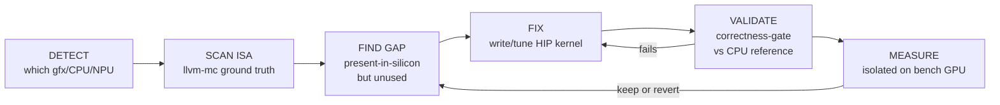

# optimizer-agent

A **private, fully-local AI agent** that tunes LLM inference on AMD Radeon — by running real experiments on the silicon, never by guessing.

The brain is a local tool-calling model (served by [Lemonade](https://github.com/lemonade-sdk/lemonade), pinned to one GPU, fits in 32 GB). Its tools run **real benchmarks on the other GPU**, isolated via `HIP_VISIBLE_DEVICES`, so a measurement is never corrupted by the brain's own inference. The brain can't invent a number — it can only *learn* by calling a tool that measures on-device. That's the whole thesis: optimize inference the way a human engineer does — hypothesize, build, measure, keep or revert — but on a local model, on your own machine.

> Nothing leaves the box. No cloud API is required to run the loop. (An optional escalation path to a Radeon-cloud model exists for the rare case the local brain is genuinely stuck — see the [submission repo](#related).)

## The mission loop



Every edge is a tool call against real hardware. Correctness is gated *before* speed is ever reported.

## The whole AMD-AI substrate

`hardware.py` maps **18 targets** — the agent detects what it's on and reaches for the lever that arch actually has:

| Class | Targets |
|---|---|
| **GPU** | RDNA2→next-gen `gfx1030/1100/1151/1200/1201/1250` · CDNA1-4 `gfx908/90a/942/950` |
| **CPU** | Zen3/4/5 `znver3/4/5` — EPYC · Threadripper (WX/PRO) · Ryzen |
| **NPU** | XDNA1/2 — Ryzen AI |
| **APU** | Strix Halo · Strix Point · Phoenix (CPU+iGPU+NPU, unified memory, decomposed via `engines[]`) |

`gfx950` + `gfx1250` are flagged **native-MX** — they have the scale-convert / MX-WMMA / fp4 units that are *gated* on `gfx1201`. The arch check flips per part; the agent re-runs the ISA census on whatever silicon it detects rather than porting a conclusion. See [`substrate.md`](substrate.md) for the full map and MEASURED-vs-ASSUMED status per lever.

## Run

```bash
# 1. A Lemonade OpenAI-compatible server with a tool-calling model, pinned to the brain GPU:
#    default: Qwen-AgentWorld-35B-A3B-GGUF-UD-Q4_K_XL on GPU1 @ http://localhost:13305/v1
# 2. Then:
python3 agent.py --task dflash_depth
```

Configuration is via env (defaults shown):

| Env | Default | Meaning |
|---|---|---|
| `LEMONADE_URL` | `http://localhost:13305/v1` | brain's OpenAI-compatible endpoint |
| `BRAIN_MODEL` | `Qwen-AgentWorld-35B-A3B-GGUF-UD-Q4_K_XL` | tool-calling brain (fits one 32 GB card) |
| `BRAIN_CARD` | `1` | GPU the brain is served on (display card) |
| `TEST_CARD` | `0` | GPU benchmarks run on, isolated (compute card) |

## Layout

| File | Role |
|---|---|
| `agent.py` | the mission loop — brain ↔ tools, attempt/step budget, keep-or-revert |
| `hardware.py` | 18-target AMD-AI substrate map + `detect_hardware` / ISA-scan tools |
| `codetools.py` | edit-kernel / rebuild / `bench_decode` tools (surgical: one change → rebuild → measure) |
| `research.py` | ISA / doc lookup tools |
| `memory.py` | persistent findings so a later run doesn't re-discover a closed thread |
| `tasks/` | pluggable optimization tasks — a task = (knowledge + tools + goal) |

A "task" is the unit of work: swap it to tune a different lever (DFlash depth, rpb, quant choice) or target different hardware. Runtime state (`memory/`, `*.bak.jsonl`, `__pycache__`) is gitignored.

## Related

- **[hyperloom-kernel-optimizer](../../rocky-skill)** — the Agent Skill that packages this method for any coding-agent session
- **[rocky-hackathon](../../rocky-hackathon)** — the AMD DevMaster submission that wraps this agent (adds the Radeon-cloud escalation bridge)

## License

MIT © The-Monk — see [LICENSE](LICENSE).
